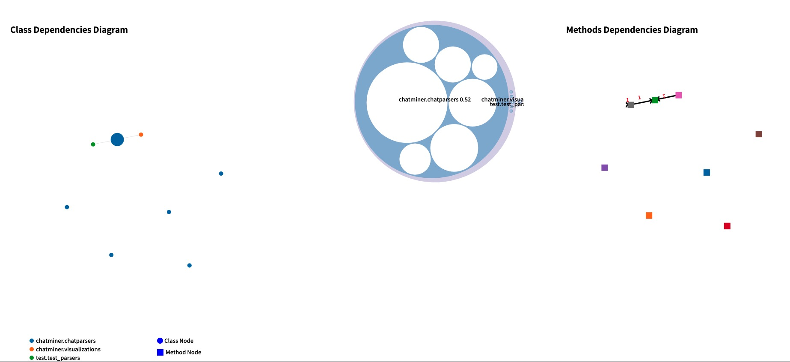

# Dynamic Analysis

### Project Goals
- This project will help new programmers get to know what a new Java/Python project does and help them get familiar and develop the project. It will do a dynamic analysis that records information such as data flow in objects and classes, executing flow, and so on.
  
- UML diagram generator from Java program
- Function dependencies analysis
  - Display modified instances during function scope
  - Display created instances during function scope
  - Display referenced instances (fields, and parameters) 
- Frontend page to display data visualization 

### User Flow
  - A Python programmer is asked to work on a new project with fairly complicate complexity and he/she is not familiar with the project. He/she wants to know what the project does and how the project works. He/she can use our tool to visualize the project and get familiar with the project.
  - A testcase is needed to run the project and generate the data for our tool to visualize.
  - We are using call flows to visualize the project. The user will first run our tool to modify the original project, then he/she can run the project with the testcase to generate the data for our tool to visualize. The user can then use our tool to visualize the project.

Some graph analysis and how it work:
- Class Dep. Diagram: 
  - Mark type:
    - The Mark type for the node is the point and the mark type for the link is the line
    - Each node represents a class 
  - The shape is used to differentiate the Class Node and Methods node.
  - Channel:
  - Colour is used for different module 
  - Size is used for class centrality

Interactions:

Class Dep. diagram:
  - Hover/Click for the tooltip
  - Click nodes to select a class, which updates the view in the circular graph
  - Click outside to reset this view
  
Methods Deps diagram:
  - Hover/Click for the tooltip
  - Click nodes to select a method, which updates the view in the Dep. diagram
  - Click outside to reset this view

Circular Packing View:
  - Click the circle will zoom in, it also shows the name of the class/methods
  - Click outside zoom out

